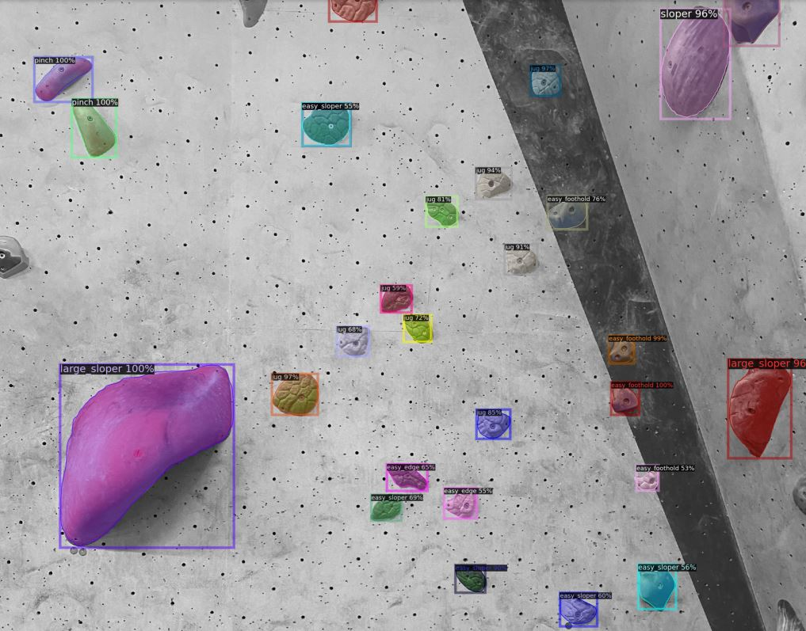
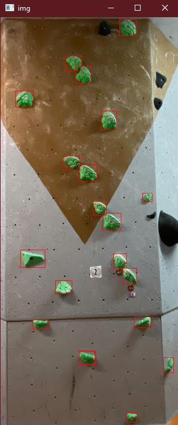

# Indoor Bouldering Route Classification using Image Processing and Deep Learning

Note that this project is still a work in progress so there's not much to explain in the README until I publish my report!
## Table of Contents

  * [🗺️ Overview](#%EF%B8%8F-overview)
  * [👀 Sneak-peak progress](#%EF%B8%8F-overview)
  

## 🗺️ Overview

A third year project that uses image processing techniques and deep learning methods in an attempt to classify the grade of indoor bouldering routes on the Hueco 'V' scale based on a single image of the route. I used the **Detectron2 API** to train a **Mask R-CNN** model that allows for the detection of holds on a climbing wall through **object segmentation**. Information about the holds such as type of hold and the area of the hold is extracted from the Mask R-CNN model. Further information is extracted from the image of the route such as distance between successive holds, the total number of holds and the distance travelled in total from the first hold to the final hold. Scaling of the area of the hold is done based on the distance between detected dots on the climbing wall. All of this information is passed onto a **bidirectional GRU RNN** which classifies the route.

## 👀 Sneak-peak progress

### Hold Detection
Using my trained model for object instance segmentation and classification. The classification accuracy is okay.

### Route Detection
Detecting the colour of each segmented hold and filtering only the relevant holds to the intended route (here I want only the green VB-0 route).

## TODO

- [ ] Update README with more titles and information (once the project is complete!)
- [ ] Upload final models and progress (once the project is complete!)
